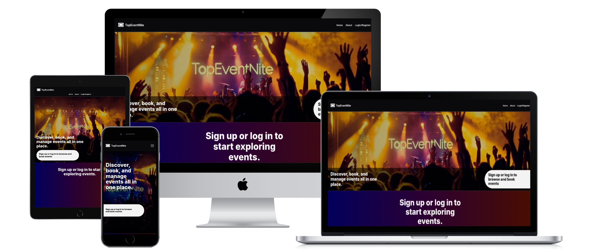
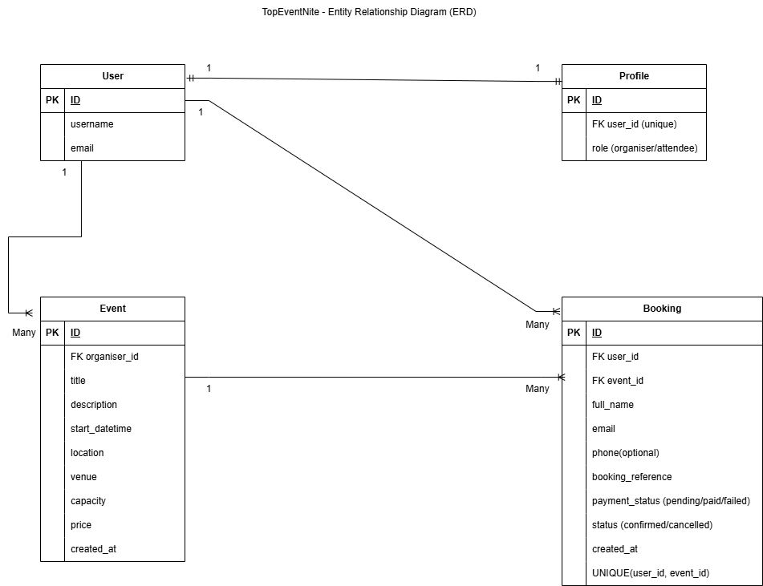

# TopEventNite


<p align="center">
  <a href="https://topeventnite-vanessa-f8272a2fa386.herokuapp.com/" target="_blank">
    View Live Website
  </a>
</p>

## Table of Contents

- [Project Overview](#project-overview)

- [UX / UI Design](#ux--ui-design)
  - [User Experience (UX)](#user-experience-ux)
  - [User Interface (UI)](#user-interface-ui)
  - [Accessibility](#accessibility)
  - [User Stories](#user-stories)
  - [Design Choices](#design-choices)
    - [Colours](#colours)
    - [Typography](#typography)
    - [Layout and Structure](#layout-and-structure)
    - [Imagery](#imagery)
    - [Wireframes](#wireframes)

- [Core Functionality](#core-functionality)
  - [Authentication System](#authentication-system)
  - [Event Management](#event-management)
  - [Booking System](#booking-system)
  - [Payment Integration (Stripe)](#payment-integration-stripe)

- [Database Design](#database-design)

- [Built With](#built-with)

- [Testing](#testing)

- [Deployment](#deployment)

- [Security](#security)

- [Future Features](#future-features)

- [Credits](#credits)

- [AI Tool Usage & Reflection](#ai-tool-usage--reflection)

## Project Overview

TopEventNite is a full-stack event management and ticket booking platform designed to allow organisers to create and manage events, while attendees can browse, book, and manage their tickets in a simple and user-friendly way.

The main purpose of the application is to provide a streamlined experience for both event organisers and attendees. Organisers can easily create, edit, and delete events, while attendees can explore available events, complete bookings through an integrated payment system, and manage their bookings in one place.

The idea for TopEventNite was inspired by modern event platforms that combine event discovery with seamless ticket booking. The focus of this project was to create a system that not only supports core functionality such as CRUD operations and authentication, but also incorporates real-world features such as payment integration, booking validation, and role-based access control.

This project was built using Python and the Django framework for the backend, with PostgreSQL for database management. Stripe was integrated to handle secure payment processing, and Cloudinary was used for image uploads. The front-end was developed using HTML, CSS, and JavaScript, with a strong emphasis on responsive design and user experience.

TopEventNite demonstrates the development of a full-stack application that connects front-end interfaces with back-end logic, handles user authentication and permissions, manages data efficiently, and provides a complete end-to-end user journey from event creation to booking confirmation.

## UX / UI Design

The design of TopEventNite focuses on creating a modern, engaging, and user-friendly platform for discovering, booking, and managing events. The interface is inspired by real-world event and entertainment platforms, with a strong emphasis on clarity, accessibility, and responsiveness across devices.

---

### User Experience (UX)

The user experience is designed around two primary user roles:

- **Attendees** who want to browse and book events
- **Organisers** who want to create and manage events

The application follows a clear and intuitive user flow:

- New users can quickly register and select their role
- Attendees are directed to browse available events
- Organisers are guided to create and manage their own events
- Booking and payment processes are streamlined to reduce friction

Navigation is consistent across all pages using a shared layout, ensuring users always know how to move between sections such as Home, Events, and My Bookings.

Feedback is provided throughout the application using:
- Success messages (e.g. booking confirmation)
- Error alerts (e.g. incorrect login details)
- Conditional UI changes (e.g. “Sold Out” events)

---

### User Interface (UI)

The interface uses a clean, modern, and visually engaging design style suitable for an event platform.

Key UI features include:

- **Hero section with video background** to create an immersive first impression
- **Card-based layout** for displaying events clearly and consistently
- **Glassmorphism-style containers** to enhance visual hierarchy
- **Clear call-to-action buttons** such as “Book Ticket”, “Create Event”, and “View Details”
- **Responsive navigation bar** that adapts into a hamburger menu on smaller screens

Visual consistency is maintained through:
- Reusable components (cards, buttons, forms)
- Consistent spacing, padding, and alignment
- Structured page layouts across all views

---

### Accessibility

Accessibility was considered throughout the design and development process:

- Use of **semantic HTML elements** for better screen reader support
- **Clear contrast between text and background** for readability
- **Form labels placed above inputs** for clarity and usability
- **Responsive layouts** to support different screen sizes and devices
- Avoidance of relying solely on colour to convey meaning (e.g. text labels like “Sold Out”)

---

### User Stories

User stories were managed using GitHub Issues and prioritised using the MoSCoW method (Must Have, Should Have, Could Have).

---

#### Must Have (Critical for MVP)

These features were essential for the core functionality of the application:

- Register account
- Login to account
- Logout of account
- Browse events
- View event details
- Book an event
- Make payment for event booking
- View booking details
- View my bookings
- Create an event

---

#### Should Have (Important but not critical)

These features improve functionality and user experience but are not essential for the minimum viable product:

- Edit an event
- Delete an event
- View event bookings (organiser)
- Cancel a booking
- Prevent double booking

---

#### Could Have (Nice to have)

These features enhance usability and polish but are not required for core functionality:

- Responsive design
- Navigation menu
- Filter events by location
- Download ticket / QR code
- Print attendee list

---

### Agile Planning

The project was planned and tracked using GitHub Issues, where each user story was created, labelled, and prioritised based on its importance to the overall system.

This approach allowed for:

- Clear breakdown of features into manageable tasks
- Prioritisation of core functionality first (MVP)
- Flexibility to add enhancements over time
- Tracking progress throughout development

Each user story contributed directly to the development of key features such as authentication, event management, and booking functionality.

---

### Design Choices

The design aims to reflect a modern event and nightlife platform, using bold visuals and strong contrast to create an engaging experience.

---

### Colours

TopEventNite uses a dark, event-inspired colour palette with strong contrast for readability and a modern glassmorphism effect.

| Purpose | Colour | Value |
|--------|--------|-------|
| Primary Background | Dark / Black | `#111111`, `#0f0f12` |
| Gradient Backgrounds | Navy → Purple → Burgundy | `#07002f` → `#18003f` → `#4b0000` |
| Homepage Gradient | Blue → Plum → Burgundy | `#02005c` → `#2a0034` → `#4a0d00` |
| Text Colour | White | `#ffffff` |
| Secondary Text | Light White | `rgba(255,255,255,0.8)` |
| Buttons / Pills | Off White | `#f2f2f2` |
| Glass Effect | Transparent White | `rgba(255,255,255,0.1)` |
| Success / Confirmed | Green | `#4ade80`, `#2e7d32` |
| Error / Sold Out | Red | `#c62828`, `#8b0000` |

---

### Typography

The **Inter** font, sourced from Google Fonts, is used throughout the application.

Inter was chosen for its clean, modern appearance and excellent readability across different screen sizes. Its simple and professional style aligns with the event-platform aesthetic, ensuring text remains clear and accessible on both desktop and mobile devices.

Font weights are used to create hierarchy:
- **Bold (700–800):** Headings and key titles  
- **Medium (500–600):** Subheadings and labels  
- **Regular (400):** Body text and descriptions  

---

### Layout and Structure

The layout of TopEventNite is designed to be consistent, responsive, and easy to navigate across all pages.

A shared base layout is used throughout the application, ensuring that elements such as the navigation bar and footer remain consistent across different views. This helps users move between pages such as Home, Events, and My Bookings without confusion.

The structure of the site is built around clear sections:

- A **hero section** on the homepage featuring a video background and key messaging
- A **card-based layout** for displaying events in a clean and organised way
- **Form-based layouts** for actions such as registration, login, and event creation
- **Detail pages** that display full event information alongside actions like booking or editing

Content is grouped logically using containers and spacing to improve readability and visual hierarchy.

The layout is fully responsive:

- On larger screens, content is displayed using grid layouts and side-by-side sections
- On smaller devices, layouts stack into a single column for better usability
- Navigation adapts into a hamburger menu on mobile devices

This structure ensures that the platform remains functional and user-friendly across desktop, tablet, and mobile devices.

---

#### Imagery

Imagery plays an important role in enhancing the user experience:

- Event images are displayed prominently to attract user attention
- A **video background** is used on the homepage to create a dynamic and engaging feel
- Images are positioned alongside event details to provide context and improve visual appeal

The use of imagery supports the platform’s purpose of showcasing events in an engaging and visually appealing way.

---

### Wireframes

Initial wireframes were created to plan the layout and functionality of the application.

[View Wireframes](wireframes/wireframes.md)

---

## Core Functionality

TopEventNite was developed as a full-stack event platform with separate functionality for attendees and organisers. The application combines authentication, event management, ticket booking, and payment processing to create a complete end-to-end user journey.

---

### Authentication System

The application includes a role-based authentication system that allows users to register, log in, and log out securely.

During registration, users choose whether they are signing up as an **attendee** or an **organiser**. This role is then used to control what features they can access throughout the site.

- **Attendees** can browse events, book tickets, and manage their bookings
- **Organisers** can create, edit, and delete events, as well as view attendee lists for their own events

Access control is enforced both in the user interface and in the backend, preventing users from manually accessing pages that do not match their role.

### Event Management

Organisers can manage events through full CRUD functionality.

This includes:

- **Create** new events with details such as title, description, date and time, location, venue, capacity, price, and event image
- **Read** event information through the event listing and event detail pages
- **Update** existing event details through a pre-filled edit form
- **Delete** events through a confirmation modal

This functionality allows organisers to manage their own event listings without needing access to the Django admin panel.

### Booking System

Attendees can browse available events, view full event details, and book tickets for events they want to attend.

The booking system includes key business logic such as:

- preventing duplicate bookings for the same event
- preventing bookings when an event is sold out
- displaying booking confirmation details after a successful booking
- allowing users to view all of their bookings in one place
- allowing users to cancel bookings through a confirmation modal

The platform also updates event availability dynamically, showing when an event has become sold out and removing the booking option where necessary.

### Payment Integration (Stripe)

Stripe was integrated to handle event payments securely.

When an attendee clicks **Book Ticket**, they are redirected to Stripe Checkout to complete payment. After a successful payment, the user is returned to a booking confirmation page showing the event details and booking status.

A payment cancel flow is also included so that users are redirected appropriately if checkout is cancelled before payment is completed.

This integration adds a real-world feature to the project and supports a full booking journey from browsing an event to receiving confirmation after payment.

---

## Database Design 

TopEventNite uses a relational database managed through Django’s ORM. The database is designed to support user roles, event management, and ticket bookings while maintaining clear relationships between models.

### Entity Relationship Diagram (ERD)



The ERD above illustrates the structure of the database and the relationships between the core models: User, Profile, Event, and Booking.

---

### Data Models

The application is built around three main models:

#### User & Profile

Django’s built-in `User` model is used for authentication, storing login credentials such as username, email, and password.

A custom **Profile** model is linked to the User model using a one-to-one relationship. This model stores the user’s role:

- **Organiser**
- **Attendee**

This allows the system to control access to features based on user type.

#### Event

The Event model stores all information related to an event created by an organiser.

Key fields include:
- Title
- Description
- Date and time
- Location and venue
- Capacity (maximum number of attendees)
- Price
- Event image
- Organiser (linked to User)

Each event is associated with one organiser, while an organiser can create multiple events (one-to-many relationship).

#### Booking

The Booking model connects users to events and represents a ticket purchase.

Key fields include:
- User (attendee)
- Event
- Booking reference
- Status (e.g. confirmed, cancelled)
- Timestamp

This creates a many-to-one relationship:
- A user can have multiple bookings
- An event can have multiple bookings

### Relationships Overview

- One **User** → One **Profile**
- One **User (Organiser)** → Many **Events**
- One **User (Attendee)** → Many **Bookings**
- One **Event** → Many **Bookings**

### Data Integrity

Django’s ORM is used to enforce relationships and ensure data consistency. Validation is handled both at form level and model level to prevent invalid data, such as overbooking events or duplicate bookings.

Migrations are used to track and apply changes to the database schema throughout development.

---

## Built With

The TopEventNite platform was developed using the following technologies:

### Frontend
- HTML5 – for structuring web pages  
- CSS3 – for styling and layout  
- Bootstrap – for responsive design and UI components  

### Backend
- Python – core programming language  
- Django – web framework used to build the application and handle routing, models, and views  

### Database
- SQLite (development) – default Django database used during development  
- PostgreSQL (production) – used when deploying to Heroku  

### Other Tools & Technologies
- Stripe – payment integration for booking tickets  
- Cloudinary – for storing and managing uploaded images  
- Git & GitHub – version control and project management  
- Heroku – deployment platform for hosting the live application  

## Testing

Details of testing can be found here:

[View Testing Documentation](testing.md)

---

## Deployment

The application was deployed using **Heroku**.

### Steps for Deployment

1. The project was pushed to GitHub repository  
2. A new app was created on Heroku  
3. The Heroku app was connected to the GitHub repository  
4. Environment variables were configured (e.g. SECRET_KEY, Stripe keys, Cloudinary)  
5. PostgreSQL database was added via Heroku  
6. Static files were configured using WhiteNoise  
7. The application was deployed via the Heroku dashboard  

### Live Application

The live site can be accessed here:  
https://topeventnite-vanessa-f8272a2fa386.herokuapp.com/

### Local Deployment

To run locally:

1. Clone the repository  
2. Create a virtual environment  
3. Install dependencies:
   ```bash
   pip install -r requirements.txt
   ```
4. Set environment variables  
5. Run migrations:
   ```bash
   python manage.py migrate
   ```
6. Start server:
   ```bash
   python manage.py runserver
   ```

---

## Security

Several security measures were implemented to protect user data and ensure safe interaction with the application:

- Sensitive data such as secret keys and API keys are stored in environment variables  
- Django’s built-in authentication system is used for secure login and password handling  
- CSRF protection is enabled to prevent cross-site request forgery  
- Role-based access control ensures only organisers can create or manage events  
- Stripe is used for secure payment processing, preventing sensitive card data from being handled directly by the application  
- Input validation is implemented on forms to prevent invalid or malicious data  

These measures help ensure the application follows best practices for web security.


---
## Future Features

Several improvements and additional features could be implemented in the future:

- Downloadable tickets with QR codes for event entry  
- Organiser ability to print attendee lists  
- Image optimisation and lazy loading for improved performance  
- Advanced event filtering (e.g. by date, category, price)  
- User profile management and editing  
- Email notifications for bookings and confirmations  
- Dashboard analytics for organisers (e.g. ticket sales, attendance)  
- Improved mobile UI for form elements such as dropdowns 

---

## Credits

### Development

- Project designed and developed by Vanessa Addo  

### Technologies

- Django  
- Python  
- HTML, CSS, Javascript  
- PostgreSQL  
- Stripe  
- Cloudinary  

### Tools & Resources

- Google Fonts (Inter)  
- Font Awesome (icons)  
- W3C Validators (HTML & CSS)  
- Google Lighthouse  
- GitHub & Heroku  

### Media

- Event images sourced from Pexels  
  - https://www.pexels.com/search/circus%20event/  
- Background hero media originally sourced from Pexels and converted into a video using Canva AI (Image-to-Video feature)  

All media used is for educational and non-commercial purposes.  

---

## AI Tool Usage & Reflection

AI tools were used throughout the development of this project to support learning, debugging, and improving efficiency.

### Usage

- ChatGPT was used to:
  - Assist with debugging errors and resolving issues  
  - Provide guidance on Django structure and implementation  
  - Help refine UI/UX decisions  
  - Support writing documentation and README structure  

- GitHub Copilot was used to:
  - Suggest code snippets and speed up development  
  - Assist with repetitive coding tasks  

### Reflection

AI tools were used as a support system rather than a replacement for learning. All generated code and suggestions were reviewed, tested, and adapted to ensure full understanding.

Using AI improved productivity and helped reinforce concepts such as backend logic, form handling, and responsive design, while maintaining control over the final implementation.