## Testing

- [HTML Validation](#html-validation)
- [CSS Validation](#css-validation)
- [Performance Testing & Validation](#performance-testing--validation)
- [Summary of Findings](#summary-of-findings)
- [Improvements Implemented](#improvements-implemented)
- [Future Improvements](#future-improvements)
- [Accessibility Testing](#accessibility-testing)
- [Responsive Testing](#responsive-testing)
- [Manual Testing](#manual-testing)
- [Deployment Testing](#deployment-testing)
- [Known Bugs](#known-bugs)

### HTML Validation

HTML code was validated using the **W3C Nu HTML Checker** on the deployed version of the application.

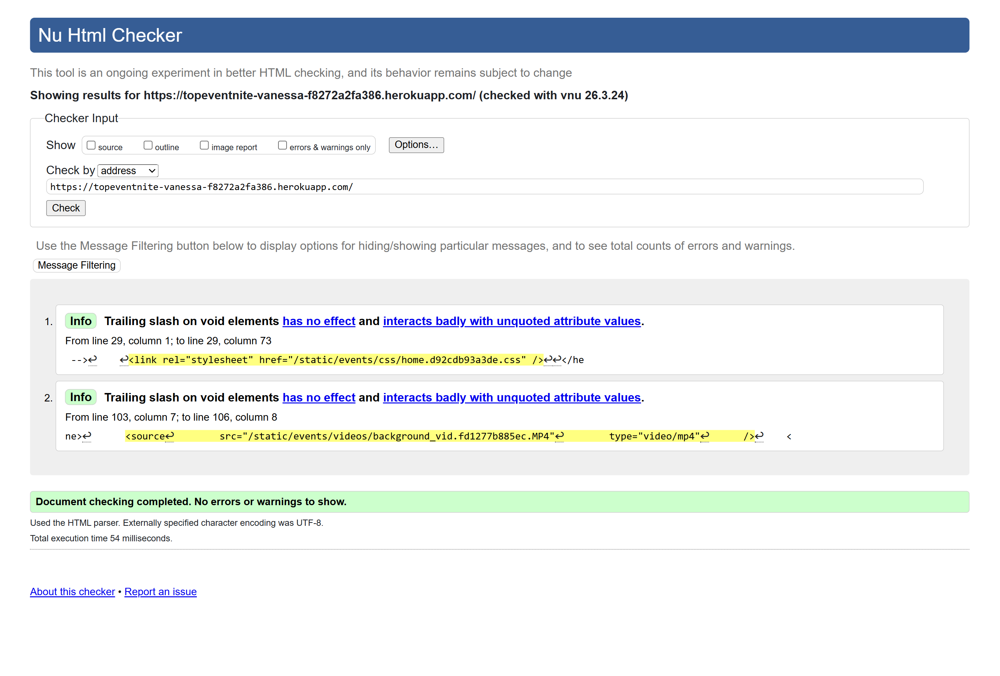

The home page returned **no HTML errors**. The validator only reported minor informational notices about trailing slashes on void elements, which do not affect functionality or page rendering.

This confirms that the HTML structure is valid and follows current standards.

---

### CSS Validation

CSS was validated using the **W3C CSS Validator** on the deployed version of the application.

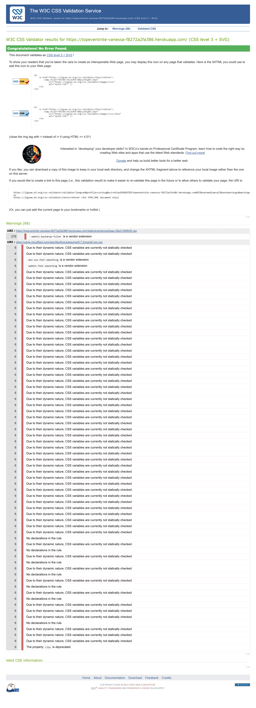

The deployed site returned **no CSS errors**.

A number of warnings were shown, but these were non-critical and mainly related to:

- vendor-specific properties such as `-webkit-backdrop-filter`
- external Font Awesome stylesheet rules
- dynamically checked CSS variables
- a deprecated `clip` property from third-party CSS

These warnings do not affect the functionality or presentation of the project, and the application remains fully styled and operational across the tested pages.

## Performance Testing & Validation

Performance, accessibility, and SEO were tested using **Google Lighthouse** across multiple pages and user roles (attendee and organiser). Testing was conducted on both **desktop and mobile views**.

---

### Desktop Lighthouse Results

#### Home Page
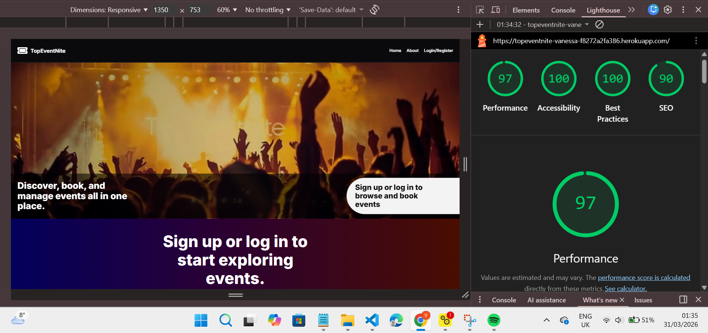

- Performance: 97  
- Accessibility: 100  
- Best Practices: 100  
- SEO: 90  

---

#### Login Page
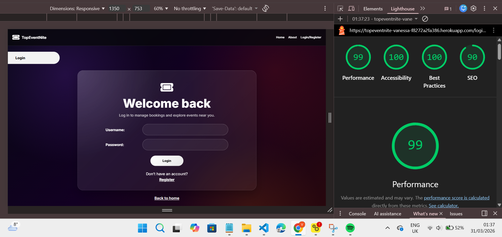

- Performance: 99  
- Accessibility: 100  
- Best Practices: 100  
- SEO: 90  

---

#### Register Page
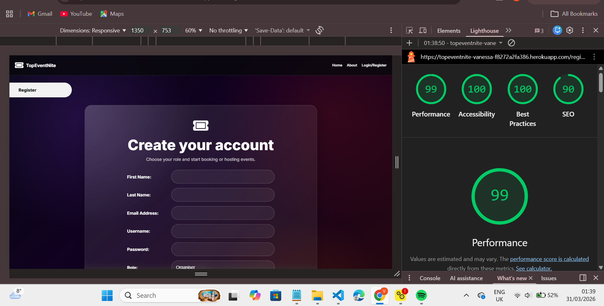

- Performance: 99  
- Accessibility: 100  
- Best Practices: 100  
- SEO: 90  

---

#### Create Event Page
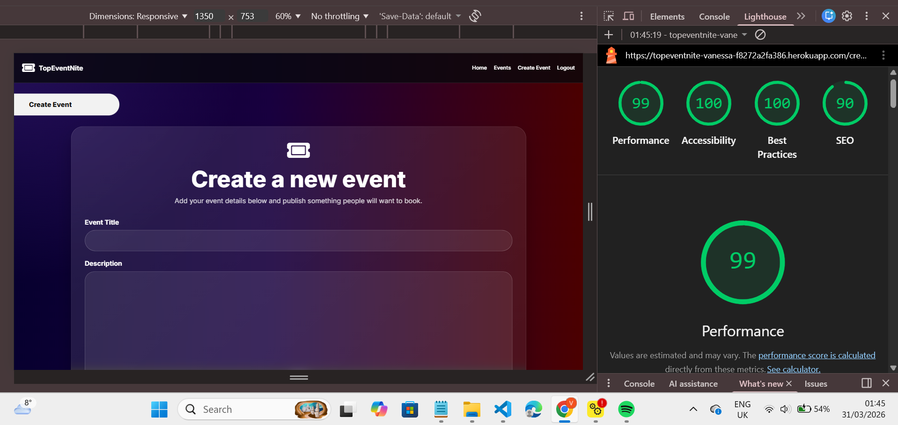

- Performance: 99  
- Accessibility: 100  
- Best Practices: 100  
- SEO: 90  

---

#### Booking Confirmation Page
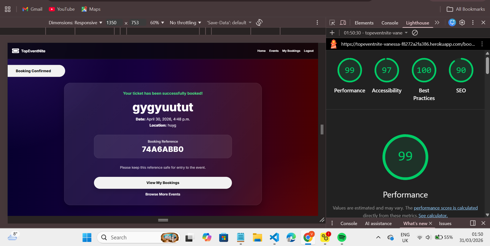

- Performance: 99  
- Accessibility: 97  
- Best Practices: 100  
- SEO: 90  

---

#### Events Page (Organiser View)
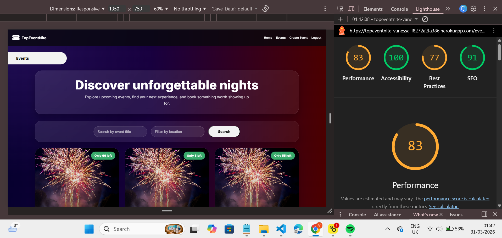

- Performance: 83  
- Accessibility: 100  
- Best Practices: 77  
- SEO: 91  

---

#### Event Details Page (Organiser View)
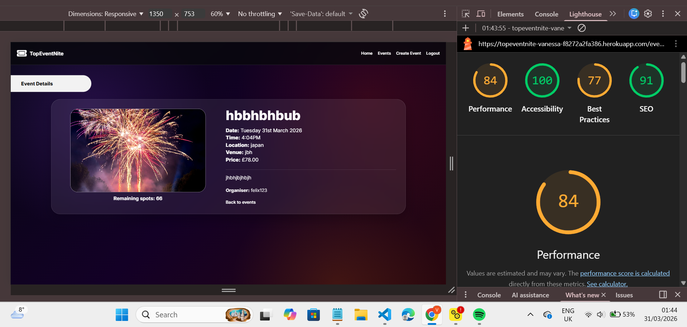

- Performance: 84  
- Accessibility: 100  
- Best Practices: 77  
- SEO: 91  

---

#### My Bookings Page
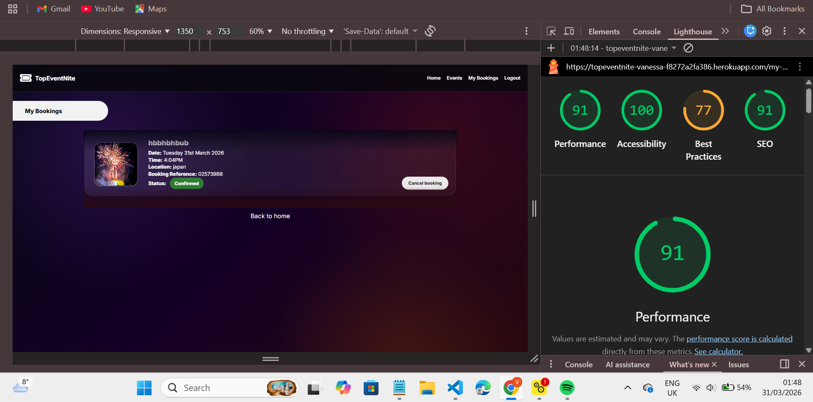

- Performance: 91  
- Accessibility: 100  
- Best Practices: 77  
- SEO: 91  

---

#### Home Page (Organiser View)
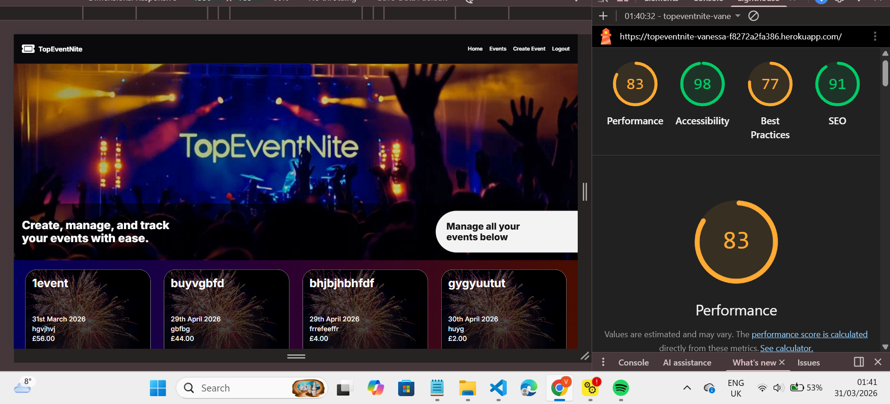

- Performance: 83  
- Accessibility: 98  
- Best Practices: 77  
- SEO: 91  

---

### Mobile Lighthouse Results

#### Event Details (Organiser)
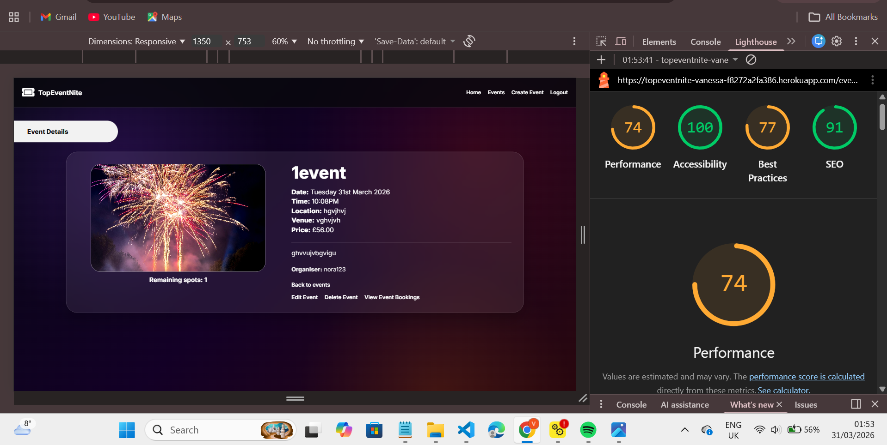

- Performance: 74  
- Accessibility: 100  
- Best Practices: 77  
- SEO: 91  

---

#### Events Page (Organiser)
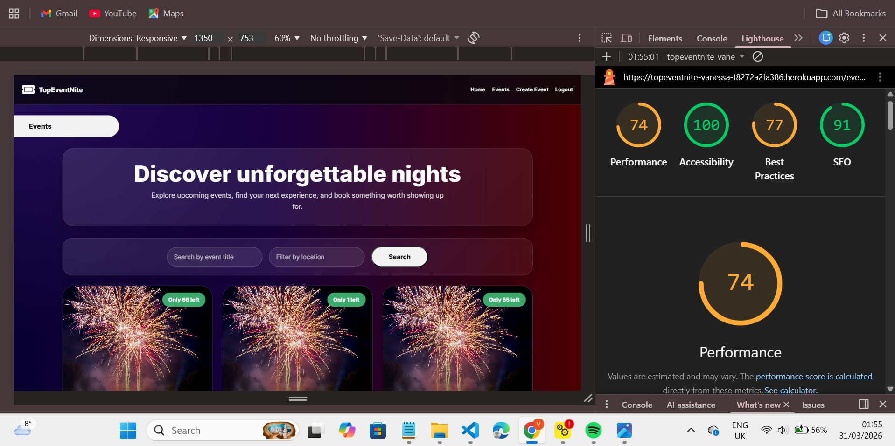

- Performance: 74  
- Accessibility: 100  
- Best Practices: 77  
- SEO: 91  

---

#### Home Page (Organiser)
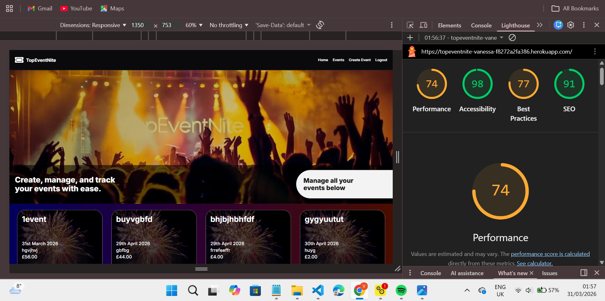

- Performance: 74  
- Accessibility: 98  
- Best Practices: 77  
- SEO: 91  

---

## Summary of Findings

- Accessibility scores are consistently high (98–100), demonstrating strong adherence to WCAG guidelines  
- Performance is excellent on desktop (83–99) and slightly lower on mobile (74), likely due to:
  - Large background images/videos  
  - Multiple event cards loading simultaneously  
- Best Practices scores (77) indicate minor improvements needed:
  - Optimising image formats (e.g., WebP)  
  - Reducing unused CSS/JS  
- SEO scores (90–91) are strong with room for improvement  

---

## Improvements Implemented

- Compressed media assets to reduce load time  
- Used semantic HTML for accessibility  
- Ensured responsive design across devices  
- Applied consistent UI styling for better UX  

---

## Future Improvements

- Implement lazy loading for event images  
- Further compress background media  
- Introduce caching for repeated assets  
- Optimise CSS and remove unused styles  

---

## Accessibility Testing

Accessibility was tested using **Google Lighthouse** and manual checks to ensure the application is usable for a wide range of users.

### Automated Testing

Lighthouse accessibility scores ranged between **98–100** across all pages, indicating strong compliance with accessibility standards.

### Manual Checks

The following accessibility practices were implemented and tested:

- Semantic HTML elements (e.g., `<header>`, `<main>`, `<section>`)
- Clear and readable font sizes
- Sufficient colour contrast between text and background
- Descriptive button and link text
- Form inputs include labels for better usability
- Navigation is consistent across all pages

### Outcome

The application is accessible and user-friendly, with no major accessibility issues identified during testing.

---

## Responsive Testing

Responsive design was tested using **Chrome DevTools** and real device simulation.

### Devices Tested

- Mobile (iPhone SE, iPhone 12 Pro)
- Tablet (iPad Air)
- Desktop (standard laptop screens)

### Testing Approach

The following were checked across all pages:

- Layout adapts correctly to different screen sizes
- Navigation remains usable on smaller screens
- Text remains readable without overflow
- Images and cards scale appropriately
- Buttons remain clickable and well-spaced

### Outcome

The application is fully responsive. All pages display correctly across different screen sizes with no major layout issues.

---

## Manual Testing

The following test cases were carried out to ensure all core functionality of the application works as expected.

| Feature | Action | Expected Result | Actual Result | Result |
|--------|--------|----------------|--------------|--------|
| User Registration (Attendee) | User registers with valid attendee details | Account created, user logged in, redirected to attendee homepage | Worked as expected | Pass |
| User Registration (Organiser) | User registers with organiser role | Account created, user logged in, redirected to organiser homepage | Worked as expected | Pass |
| Login Validation (Incorrect Credentials) | User enters wrong password | Login blocked with error message | Error message displayed correctly | Pass |
| Access Control (Attendee Restriction) | Attendee accesses organiser URL | Access denied | Message shown: "Only organisers can create events" | Pass |
| Form Validation (Required Fields) | Submit empty required fields | Form should not submit | Browser validation triggered | Pass |
| Create Event | Organiser creates event with valid data | Event created and redirected to detail page | Worked as expected | Pass |
| Edit Event | Organiser edits event details | Changes saved and displayed | Worked as expected | Pass |
| Delete Event | Organiser deletes event | Confirmation shown, event deleted | Redirected to homepage after deletion | Pass |
| View Event Details | Attendee views event | Full event details displayed | All details shown correctly | Pass |
| Ticket Booking (Stripe) | User completes payment | Redirect to confirmation page | Booking confirmed and displayed | Pass |
| View Bookings | User views bookings | Booking appears with correct details | Displayed correctly | Pass |
| Cancel Booking | User cancels booking | Booking removed after confirmation | Removed and success message shown | Pass |
| Prevent Duplicate Booking | User tries booking twice | System blocks duplicate | Message displayed correctly | Pass |
| Sold-Out Event Handling | Event reaches capacity | Event marked as sold out | Booking disabled and label shown | Pass |
| Responsive (Home Page) | View on mobile | Layout adjusts correctly | Displayed correctly | Pass |
| Responsive (Events Page) | View on mobile | Cards stack and remain readable | Worked correctly | Pass |
| Responsive (Event Detail) | View on mobile | Content stacks vertically | Worked correctly | Pass |
| Responsive (Login/Register) | View on mobile | Forms usable and readable | Minor dropdown overflow issue | Pass (Minor Issue) |
| Responsive (My Bookings) | View on mobile | Layout remains usable | Worked correctly | Pass |

---

### Summary

- All core features of the application were tested and passed successfully  
- Role-based access control works correctly for both attendees and organisers  
- Stripe payment integration functions as expected  
- Responsive design works across all tested pages  
- One minor UI issue was identified on mobile (dropdown overflow), which does not affect core functionality  

---

## Deployment Testing

Deployment testing was carried out on the live Heroku application to ensure that all features function correctly outside of the local development environment.

### Testing Approach

The deployed application was tested by interacting with all key features through the live URL, including:

- User registration and login  
- Role-based access (attendee vs organiser)  
- Event creation, editing, and deletion  
- Event browsing and viewing details  
- Ticket booking and Stripe payment integration  
- Viewing and cancelling bookings  

### Results

All core features functioned correctly on the deployed application.

- Users were able to register and log in successfully  
- Organisers could create, edit, and delete events  
- Attendees could browse events and book tickets  
- Stripe payments processed correctly and redirected users to the booking confirmation page  
- Bookings were stored and displayed correctly  
- Cancel booking functionality worked as expected  

### Conclusion

The deployed application is stable and fully functional. No major differences were observed between the local development environment and the live Heroku deployment.

---

## Known Bugs

The following minor issues were identified during testing:

### 1. Role Dropdown Overflow (Mobile)

- **Issue:**  
  On the register page, when viewed on smaller screen sizes (e.g. iPhone 12 Pro), the role selection dropdown (attendee/organiser) extends beyond the screen width when opened.

- **Impact:**  
  This is a visual/UI issue only and does not affect functionality. Users are still able to select a role and complete registration successfully.

- **Status:**  
  Not fixed (low priority)

---

### 2. Lighthouse Performance Scores (Mobile)

- **Issue:**  
  Some pages (e.g. events and event detail pages) received lower Lighthouse performance scores on mobile devices.

- **Cause:**  
  This is mainly due to:
  - High-resolution images uploaded dynamically by organisers  
  - Background media such as video elements  
  - Lack of advanced optimisation (e.g. lazy loading, next-gen formats)

- **Impact:**  
  This does not affect functionality, but may slightly impact load performance on slower devices.

- **Status:**  
  Improvement identified for future optimisation

---

### 3. CSS Validation Warnings

- **Issue:**  
  The CSS validator reported multiple warnings.

- **Cause:**  
  These warnings are related to:
  - Vendor-specific properties (e.g. `-webkit-backdrop-filter`)  
  - External libraries such as Font Awesome  
  - CSS variables not being statically checked  

- **Impact:**  
  No impact on functionality or styling.

- **Status:**  
  Not considered critical

---

## Conclusion

No critical bugs were identified during testing. All core functionality of the application works as expected, and any issues found are minor and do not affect the overall user experience.