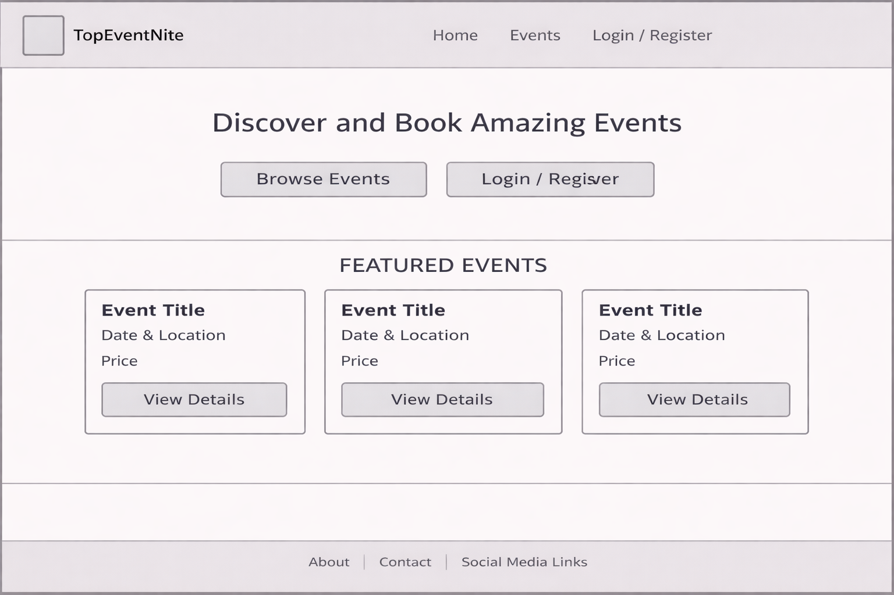
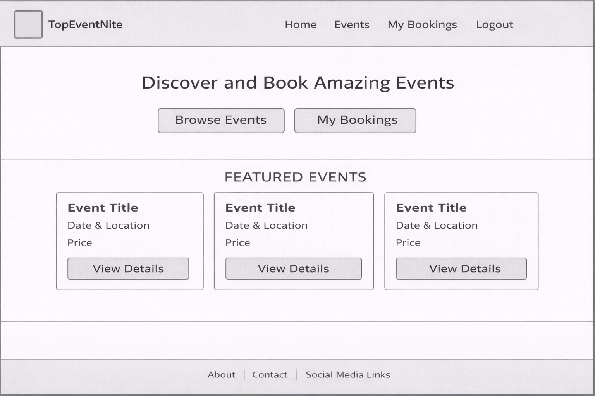
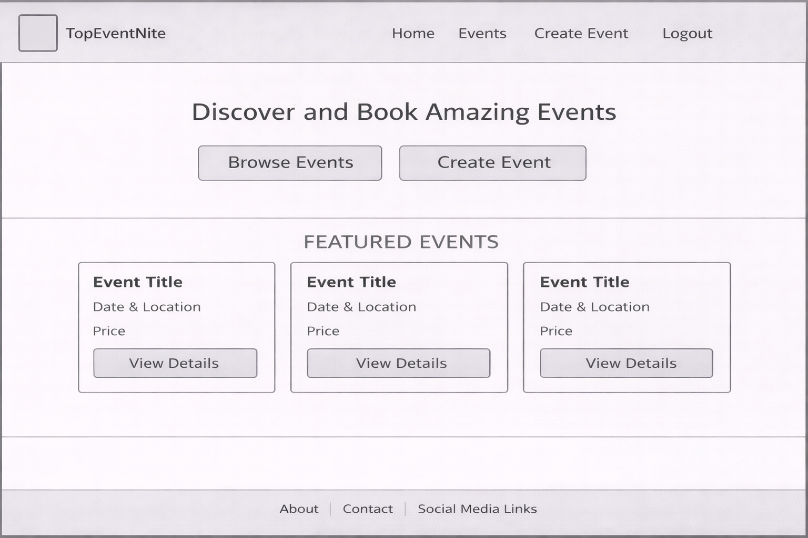
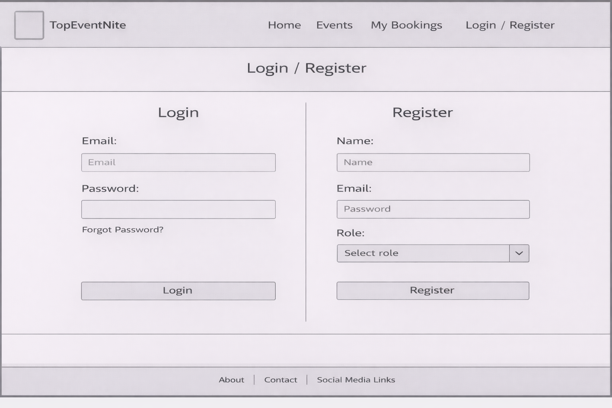
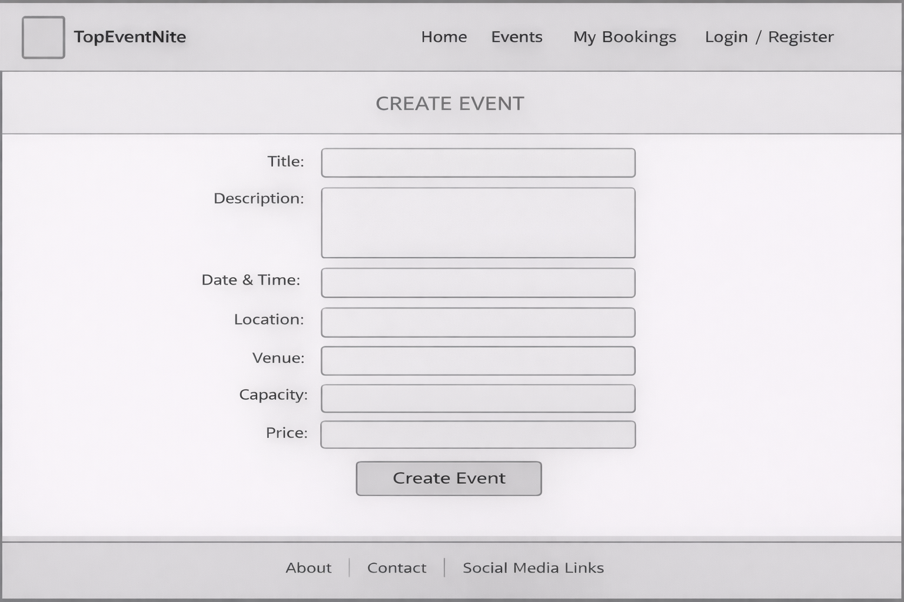
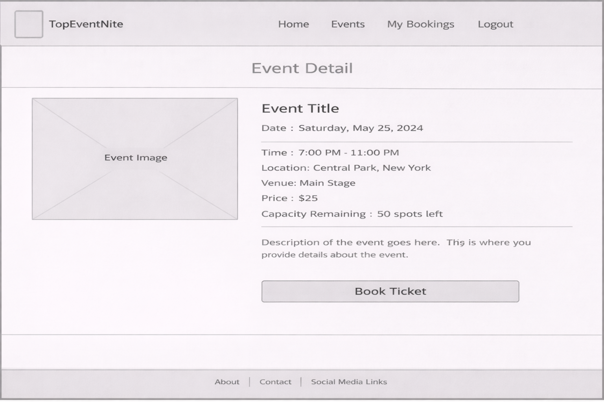
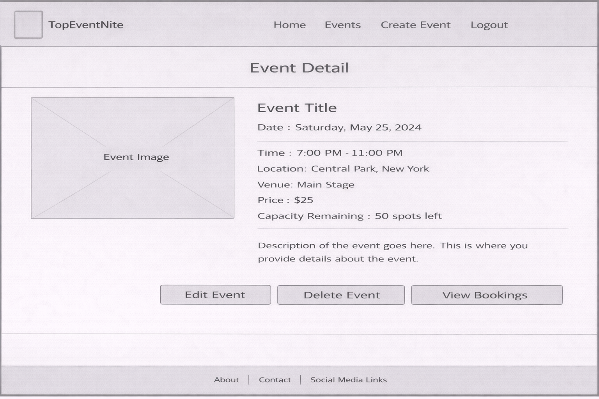
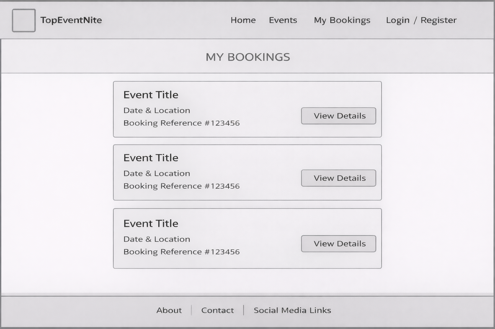
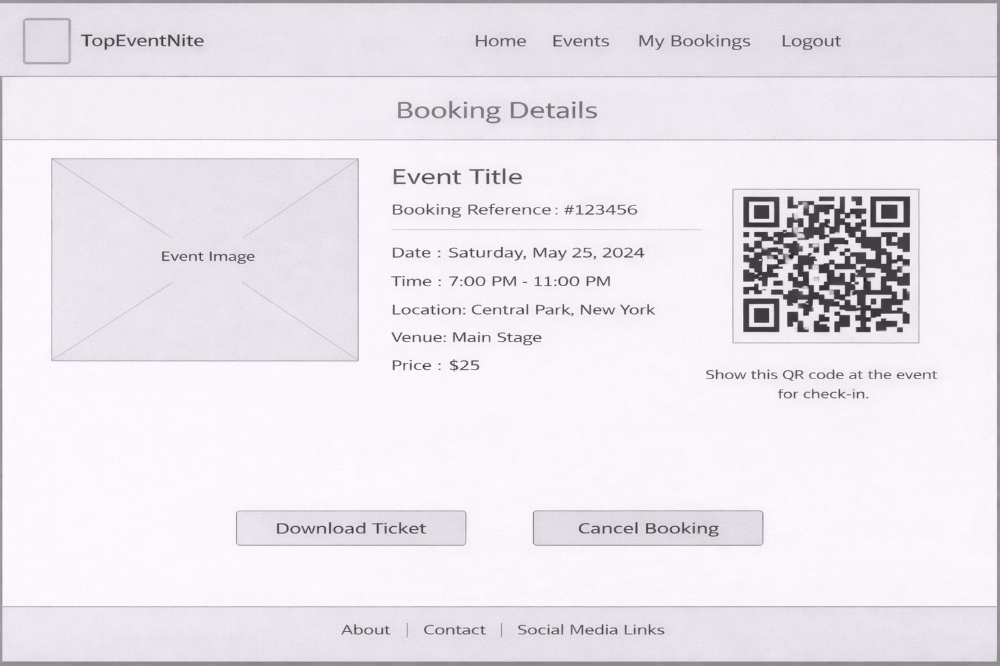
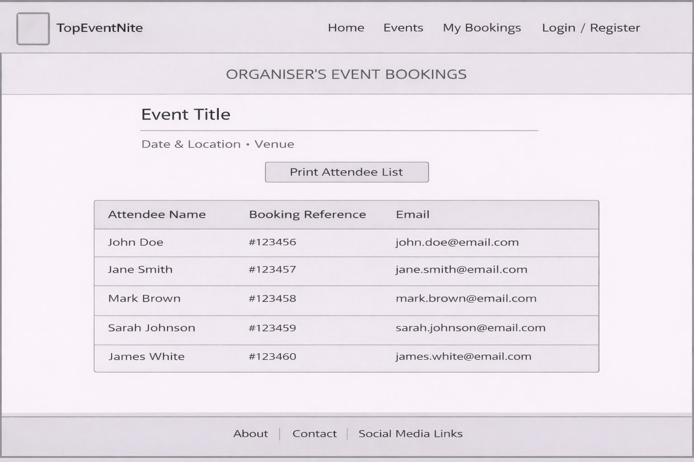

# Wireframes

These wireframes were created during the planning stage of the project to define the structure, layout, and user experience of the TopEventNite platform.

They demonstrate different user roles (default user, attendee, organiser) and key system features such as event creation, booking, and management.

---

## Home Page (Default User)

This view is shown to users who are not logged in. It encourages users to browse events or register/login.

---

## Home Page (Attendee)

Displays quick access to bookings and events for logged-in attendees.

---

## Home Page (Organiser)

Provides organisers with quick access to create events and manage listings.

---

## Login / Register Page

Allows users to either log in or create an account. During registration, users must select a role (attendee or organiser).

---

## Create Event Page (Organiser Only)

Organisers can input event details including title, description, date, location, capacity, and price.

---

## Event Detail (Attendee View)

Displays full event information and allows attendees to book tickets.

---

## Event Detail (Organiser View)

Organisers can edit, delete, or view bookings for their event.

---

## My Bookings Page

Shows all events booked by the user along with booking references.

---

## Booking Details / Ticket

Displays full booking information along with a QR code used for event check-in.

---

## Organiser – Event Bookings List

Allows organisers to view all attendees for an event and print the attendee list.